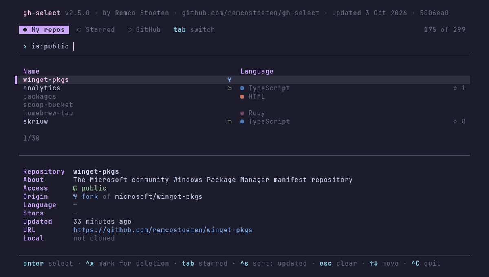

# gh-select

A fast `gh` CLI extension to **fuzzy-search your GitHub repositories**, **browse any repo's file tree without cloning**, and **partial (sparse) clone only the folders you want**. Built in Go with a self-contained terminal UI — no `fzf` or `jq` required.



`gh select` turns finding, previewing, and cloning GitHub repos into a single keyboard-driven flow in your terminal. Type to filter your repositories from cache (instant), open a repo's codebase tree to preview files via the GitHub API, mark the folders you actually need, and clone just those with a sparse `git` checkout.

## Features

- **Fuzzy repository search** — always-on search box filters your repos as you type, served instantly from cache with background refresh.
- **Browse before you clone** — navigate any repository's file tree and preview file contents straight from the GitHub API, no download needed.
- **Partial / sparse clone** — select individual folders and clone only those with `git clone --filter=blob:none --sparse`, saving bandwidth and disk on large monorepos.
- **Zero extra dependencies** — the TUI and GitHub API client are built in; no `fzf`, no `jq`.
- **One precompiled binary** — install as a `gh` extension or a standalone binary; nothing to compile.
- **Knows what you already have** — repos cloned under your clone directory are badged `local` and offer *open in editor* / *pull* instead of a redundant clone.
- **Lands where you want it** — set a clone root once (`--dir` / `GH_SELECT_CLONE_DIR`) instead of cloning into whatever directory you happen to be in.
- **`cd` into the result** — `gh select --print-path` prints the repo's path (cloning it first if needed) so a one-line shell wrapper can jump straight into it.
- **Your repos, and your org's** — owned, organization, and collaborator repositories all appear in one list.
- **Quick actions** — clone, copy repo name or URL, and open in browser without leaving the terminal.

## Installation

### As a `gh` extension (recommended)

```bash
gh extension install remcostoeten/gh-select
gh extension upgrade gh-select   # later, to update
```

Precompiled binaries are published per release, so there is nothing to build.
`gh` downloads the binary matching your OS/arch and runs it as `gh select`.

### Standalone binary (without `gh`)

Every release also ships plain executables. Grab the one for your platform from
the [Releases page](https://github.com/remcostoeten/gh-select/releases), then:

```bash
chmod +x gh-select_*        # macOS/Linux
mv gh-select_* /usr/local/bin/gh-select
gh-select                   # run directly
```

It still uses `gh` for authentication under the hood, so `gh auth login` must
have been run once.

### From source (Go)

```bash
go install github.com/remcostoeten/gh-select@latest
```

Installs the latest tagged version to `$(go env GOPATH)/bin` as `gh-select`.

### Requirements

- [GitHub CLI](https://cli.github.com/) — provides authentication (`gh auth login`)
- `git` — for cloning

No `fzf` or `jq` needed; the TUI and API client are built in.

## Usage

```bash
gh select
```

1. **Find a repo** — type to fuzzy-filter your repositories. The list loads
   instantly from cache and refreshes in the background.
   - `tab` switches between your repos, your **starred** repos and a search
     of all of GitHub, shown as tabs above the search; `shift+tab` goes back
   - GitHub search takes a name, an owner, `owner/repo`, `owner repo`,
     `owner-repo` or a pasted URL, SSH remote or `git clone` command. A
     partial owner like `heygen liveav` still finds `heygen-com/liveavatar-*`.
     Pasting a URL into any list jumps to GitHub search
   - `ctrl+s` sorts by recent, stars or name
   - `ctrl+t` cycles color themes and remembers the last one
   - filter with tokens in the search: `lang:go`, `is:private`, `is:public`,
     `is:fork`, `is:source`, `is:local` (cloned anywhere under your home
     directory, the clone root or the current directory) and
     `is:mine`, e.g.
     `cli lang:go is:mine`
   - `?` on an empty search shows every key and your live GitHub API rate
     limits: usage per bucket, how far each window has run, and when the
     current pace would run it dry. `gh select limits` prints the same
2. **Choose an action:**
   - Clone repository (full)
   - **Browse & partial clone** — open the codebase tree
   - **Releases** — read release notes and download assets: the build for
     your OS/CPU is preselected, downloads are checksum-verified, and `x`
     unpacks archives (`--download-dir` / `GH_SELECT_DOWNLOAD_DIR` sets where
     they land)
   - Copy repository name / URL
   - Open in browser
   - **Delete repository** (repositories you own)

### Deleting repositories

In the repository list, `ctrl+x` marks a repository and `ctrl+d` opens a
confirmation screen for everything marked — so a batch of dead repos goes in
one pass. A single repository can also be deleted from its action menu.

Deletion is permanent and has no undo, so it is gated:

- only repositories **you own** can be marked or deleted
- the confirmation screen lists exactly what will go, and you must retype a
  phrase — the repository's name for one, `DELETE <n>` for a batch
- local working copies are never removed, only reported

GitHub requires an extra scope for this, which `gh auth login` doesn't grant:

```bash
gh auth refresh -s delete_repo
```

### Browse & partial clone

Inside the tree browser you can navigate the entire repository **without
cloning it**. This works for any public repository, not just yours: press `tab`
in the list to reach your starred repos or search GitHub, pick a repo, then
**Browse files…**.

- `↑/↓` move · `→` open a folder or preview a file (markdown is rendered,
  code is highlighted) · `←` go up
- `/` filter the current directory · `space` mark files or folders
- `c` clone: a partial clone (`--filter=blob:none --sparse`) of only what you
  marked
- `s` save without git: the marked files and folders, or the highlighted one.
  A single file lands directly in the download directory, several keep their
  paths under a folder named after the repo. Existing files are never
  overwritten.
- `y` copy the highlighted or previewed file's contents to the clipboard
- `b` browse another branch or tag; saving, copying and `c` then use it too
- `o` open the file or folder on github.com · `Y` copy a permalink pinned to
  the current commit · `r` copy the file's raw download URL

### Options

```bash
gh select -n, --no-cache     # bypass cache, fetch fresh data
gh select -r, --refresh      # refresh cache and exit
gh select -d, --dir DIR      # clone into DIR instead of the current directory
gh select -p, --print-path   # print the selected repo's path on stdout
gh select -v, --version      # show version
gh select -h, --help         # show help
gh select doctor             # check tools + authentication
```

Environment: `GH_SELECT_CACHE_TTL` (seconds) controls cache freshness
(default 1800); `GH_SELECT_CLONE_DIR` sets the clone root;
`GH_SELECT_SCAN_DIRS` adds directories to search for existing clones,
separated like `PATH` (the clone root, current directory and home are still
searched after them);
`GH_SELECT_DOWNLOAD_DIR` (or `--download-dir`) sets where release assets and
saved files land.

### Themes

Built-in themes: `graphite` (default), `catppuccin`, `dracula`,
`everforest`, `gruvbox`, `kanagawa`, `nord`, `rose-pine`, `solarized` and
`tokyonight`.
Each has a light and a dark variant, picked from the terminal background.
Choose one with `--theme NAME` or `GH_SELECT_THEME`, or press `ctrl+t` in the
repo list. The theme picked with `ctrl+t` is saved to
`~/.config/gh-select/theme` and used when neither the flag nor the variable
is set. Panels are frameless by default; `--border` boxes them in
`rounded`, `sharp`, `double`, `thick` or `hidden`, and `--transparent`
keeps the terminal's own background. Private repos, forks and local clones
are tagged with [Nerd Font](https://www.nerdfonts.com) icons; without one,
`--icons none` or `GH_SELECT_ICONS=none` shows them as words.

A custom theme is a JSON file in `~/.config/gh-select/themes/`, named after
the theme. Colors left out come from the theme in `extends`:

```json
{
  "extends": "nord",
  "dark": { "hl": "#c792ea", "pink": "#ff5370" },
  "light": { "hl": "#7c4dff" }
}
```

The colors are `bg`, `fg`, `dim`, `hl`, `cyan`, `blue`, `green`, `pink`,
`yellow` and `red`, each as `#rrggbb`.

`extends` can name another custom theme. A file that fails to load is
skipped and named in the status line, and so is a saved theme that no longer
exists.

### A clone directory

Point gh-select at where you keep code and it stops cloning into the current
directory:

```bash
export GH_SELECT_CLONE_DIR=~/dev
```

It then scans that directory (one level deep, plus `owner/repo` layouts) for
existing working copies. Repos it finds are badged `local` in the list, and
their action menu leads with **Open in editor** (`$VISUAL`/`$EDITOR`) and
**Pull** rather than a clone that would fail.

### Jumping into a repo

A TUI can't change your shell's directory, so `--print-path` writes the
selected repo's path to stdout — cloning it first if you don't have it yet —
and everything else goes to stderr:

```fish
function ghcd
    set -l dir (gh select --print-path); and cd $dir
end
```

```bash
ghcd() { local dir; dir=$(gh select --print-path) && cd "$dir"; }
```

## Performance

- Cached list renders instantly (stale-while-revalidate; refreshed in the
  background).
- Repository fetch uses a trimmed GraphQL query (~1.4s/page) instead of the
  expensive default-branch field.
- Codebase preview is a single tree API call; file contents load on demand.

## License

MIT
